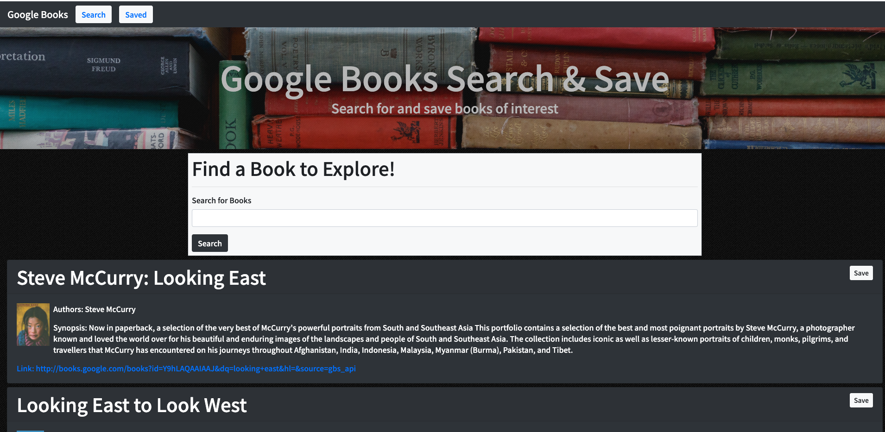
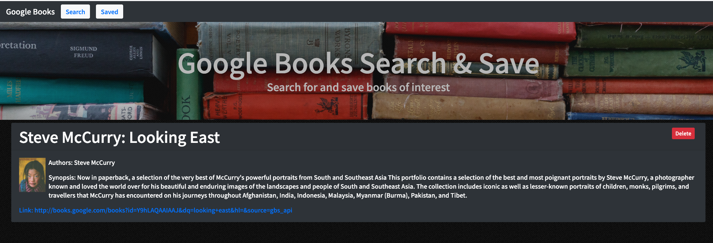

## Google Book Search
A full stack React app to search the Google Books Api, and save links to ones you are interested in. 

### Table of Contents

* Application Use
* Tech Used
* Details of App and Challenges


### Application Use

The app is a single page React Application. The user lands on a simple search page, with base level instructions, and a search bar with a submit button. The user enters in book info they wish to search for and utilizing the Google Books API, we query the Google Books app for info, and render the results on the screen for the user to peruse. 
The results also have a save button in them, allowing the user to save books they are interested in, which are saved to the MongoDB for retrieval. By using the navigation bar, the user can move to the Saved page, which displays all saved books from the database. They have an option to delete books from the database from this page. 

### Tech Used

* React.js
* Bootstrap
* Google Fonts
* Fontawsome
* Imgur
* Javascript
* Heroku
* CSS
* Mongoose
* MongoDB
* Concurrently
* React-Router-Dom
* React-Alert

## Starting The App Locally
Start by installing front and backend dependencies. While in this directory, run the following command:
```
npm install
```
This should install node modules within the server and the client folder.

After both installations complete, run the following command in your terminal:
```
npm start
```
Your app should now be running on http://localhost:3000. The Express server should intercept any AJAX requests from the client.


## Demostration
### Landing Page


### Search Books



### User can Save and Delete the books.



### Full Demo


